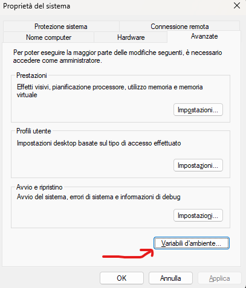
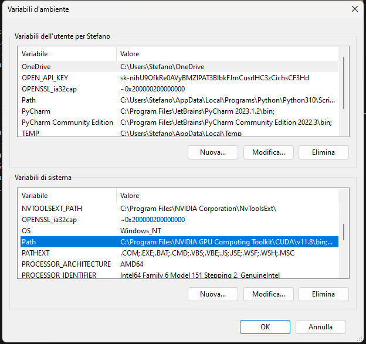
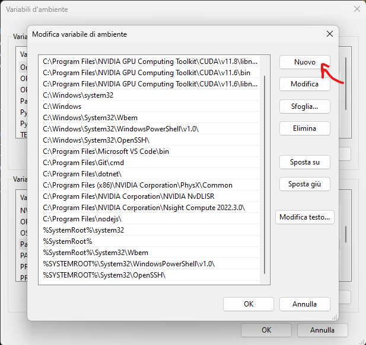

# Life Operating System

This application represents the culmination of my journey into software development, born from a desire to take control of my digital life.
My quest began with [Obsidian.md](https://obsidian.md/), where I attempted to construct a comprehensive system for managing all the aspects of my daily life. This included tracking habits, time management, financial oversight, photo organization, and numerous other facets of life I deemed important.

However, as time progressed, I found myself constrained by the limitations of relying on an external application. This realization ignited a passion that propelled me into the world of coding. Driven by the desire to create a truly personalized product, I embarked on a journey to learn software development.
This project is the fruit of that journey—a testament to curiosity, the drive for self-improvement, and the endless possibilities that open up when one decides to take the reins of technology into their own hands.

## Overview

I don't consider this project done, and probably never will be. It started with an Electron + React app, that I eventually deprecated in favour of a React Native using Expo.
Currently the codebase hosts both and my painful attempt in keeping them both working, but the desktop app is definitely not working atm.

If you wanna run the dev app, just use the command `npm run mobile` and it will create the expo connection that you can scan with the mobile expo app.
Otherwise, you can install the .apk directly to your phone and it should work as a normal app

### Desktop

While the app itself its not working, running the command `npm run desktop:server` will allow you to connect to an instance of Postgres (granted that you've installed it and ran the migration) that allows the backup of the mobile phone. Other than that, it will start a flask server which will allow you to communicate with Claude in some parts of the app

#### Installing PostgreSQL

1. Download PostgreSQL from the official website: https://www.postgresql.org/download/
2. Run the installer and follow the prompts.
3. During installation, note down the password you set for the postgres user.
4. Choose to install all components when prompted, including "Command Line Tools".

#### Setting up PATH

After installation, you need to add PostgreSQL to your system's PATH:

1. Search for "Environment Variables" in the Start menu and open it.

2. Under "System variables", find and select the "Path" variable, then click "Edit".

3. Click "New" and add the path to your PostgreSQL bin directory. It's typically:
   `C:\Program Files\PostgreSQL\{version}\bin`
   Replace {version} with your installed version (e.g., 13, 14, 15).

4. Click "OK" to close all dialogs.
